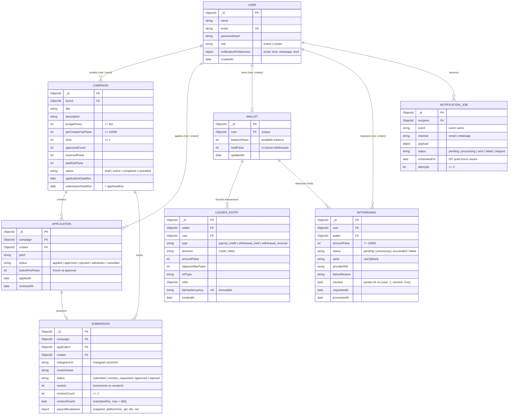

# 08. Complete Entity-Relationship (ER) Data Model

This diagram illustrates the relationships, foreign keys, cardinality, and data constraints across all 8 Mongoose models in PayPost.

---

```mermaid
erDiagram
    USER ||--o{ CAMPAIGN : "creates (role: brand)"
    USER ||--o{ APPLICATION : "applies (role: creator)"
    USER ||--o| WALLET : "owns (role: creator)"
    USER ||--o{ WITHDRAWAL : "requests (role: creator)"
    USER ||--o{ NOTIFICATION_JOB : "receives"

    CAMPAIGN ||--o{ APPLICATION : "contains"
    CAMPAIGN ||--o{ SUBMISSION : "tracks"
    
    APPLICATION ||--o| SUBMISSION : "produces"
    
    WALLET ||--o{ LEDGER_ENTRY : "records transactions"
    WALLET ||--o{ WITHDRAWAL : "disburses funds"

    USER {
        ObjectId _id PK
        string name
        string email UK
        string passwordHash
        string role "brand | creator"
        object notificationPreferences "email: bool, whatsapp: bool"
        date createdAt
    }

    CAMPAIGN {
        ObjectId _id PK
        ObjectId brand FK
        string title
        string description
        int budgetPaise ">= fee"
        int perCreatorFeePaise ">= 10000"
        int slots ">= 1"
        int approvedCount
        int reservedPaise
        int paidOutPaise
        string status "draft | active | completed | cancelled"
        date applicationDeadline
        date submissionDeadline "> appDeadline"
    }

    APPLICATION {
        ObjectId _id PK
        ObjectId campaign FK
        ObjectId creator FK
        string pitch
        string status "applied | approved | rejected | withdrawn | cancelled"
        int lockedFeePaise "frozen at approval"
        date appliedAt
        date reviewedAt
    }

    SUBMISSION {
        ObjectId _id PK
        ObjectId campaign FK
        ObjectId application FK
        ObjectId creator FK
        string instagramUrl "Instagram post/reel"
        string creatorNotes
        string status "submitted | revision_requested | approved | rejected"
        int version "increments on resubmit"
        int revisionCount "<= 2"
        date revisionDueAt "max(deadline, now + 48h)"
        object payoutBreakdown "snapshot: platformFee, gst, tds, net"
    }

    WALLET {
        ObjectId _id PK
        ObjectId user FK "unique"
        int balancePaise "available balance"
        int heldPaise "in-transit withdrawals"
        date updatedAt
    }

    LEDGER_ENTRY {
        ObjectId _id PK
        ObjectId wallet FK
        ObjectId user FK
        string type "payout_credit | withdrawal_hold | withdrawal_reversal"
        string direction "credit | debit"
        int amountPaise
        int balanceAfterPaise
        string refType
        ObjectId refId
        string idempotencyKey UK "immutable"
        date createdAt
    }

    WITHDRAWAL {
        ObjectId _id PK
        ObjectId user FK
        ObjectId wallet FK
        int amountPaise ">= 10000"
        string status "pending | processing | succeeded | failed"
        string upiId "user@bank"
        string providerRef
        string failureReason
        bool isActive "partial UK on {user: 1, isActive: true}"
        date requestedAt
        date processedAt
    }

    NOTIFICATION_JOB {
        ObjectId _id PK
        ObjectId recipient FK
        string event "event name"
        string channel "email | whatsapp"
        object payload
        string status "pending | processing | sent | failed | skipped"
        date scheduledFor "IST quiet-hours aware"
        int attempts "<= 3"
    }
```
